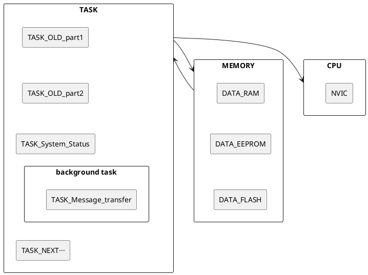
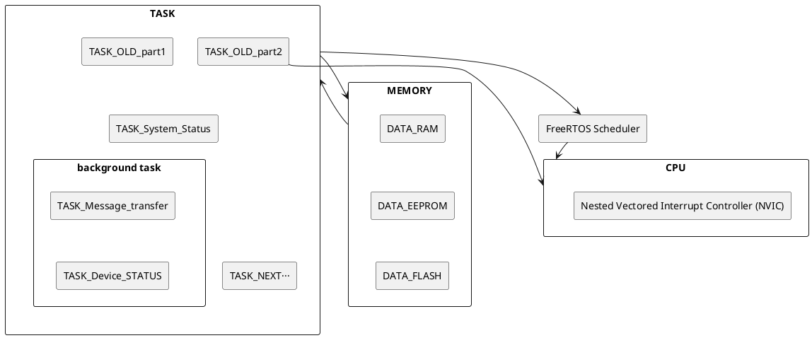

# 有关edge-oasis-bridgeware-gd-v2的移植说明

 edge-oasis-bridgeware-gd-v2工程（下文简称gd-v2）运行在GD32f103RC芯片,用于支持VCU的基本功能运行。
<!--  -->

*   CAN0接受各类报文中断。具体为接受来自MCU（电机控制器），BMS（电池管理系统）等外部设备的can类型的报文数据。
*   CAN0发送各类报文。具体为发送报文给MCU（电机控制器），BMS（电池管理系统）等各类外部设备。
*   usart1向BLE（低功耗蓝牙）发送报文数据。GD32向BLE传递当前VCU的各类`gatt_list`数据
*   usart2向GSM(SIMCOM-A7670E)发送各类AT指令。
*   usart2接受GSM(SIMCOM-A7670E)的数据
*   GPIOB10向DI已电平延时（一线通）方式向DI（显示设备）发送报文。
*   uart4与GPS通信。
*   uart5接受外部报文用于获取升级程序，写入种子和debug
*   I2C（GPIO_PIN_6 GPIO_PIN_7）向eeprom写入各类种子数据用于存储各类pagy信息。

有关edge-oasis-bridgeware-gd-v2的移植说明
## 工程结构

### 代码结构历史框架
在1.0版本中，项目采用前后台方法。在前台实现各类的功能任务的触发，在后台实现各类存储空间的调用和数据的整合计算。具体如下：

### 移植freertos代码结构框架

<!-- *   MEMORY
    *   DATA_RAM
        *   DATA_GATT:这里存储有所有`gatt_list`中的数据。具体包括`gatt_list`中的各类数据，如opid,pagy,电池电压，电流，电量，电机转速等。
        *   DATA_CAN_Rx用于存储can接受的原始报文数据
        *   DATA_CAN_Tx:这里存储这来自`gatt_list`转译的报文数据
        *   DATA_USART1_TX:这里存储有 来自`gatt_list`转译后中需要向BLE发送的报文
        *   DATA_GSM:这里存储有所有`gatt_list`转译后需要向GSM发送的报文如各类AT指令
        *   DATA_DI:这里存储有所有`gatt_list`中需要向仪表盘发送的报文。

    *   DATA_EEPROM
        *   DATA_EEPROM:这里存储有所有`gatt_list`中需要掉电保存的数据,如pagy信息
    *   DATA_FLASH
        *   DATA_FLASH:这里存储有所有`gatt_list`的升级程序

*   TASK
    *   foreground task
        *   TASK_OLD
            *   TASK_CAN_RX:CAN0接受各类报文中断。具体为接受来自MCU（电机控制器），BMS（电池管理系统）等外部设备的can类型的报文数据。
            >这里是一段引用块
            *   TASK_CAN_TX:CAN0发送各类报文。具体为发送报文给MCU（电机控制器），BMS（电池管理系统）等各类外部设备。
            *   TASK_USART1_TX:usart1向BLE（低功耗蓝牙）发送报文数据。GD32向BLE传递当前VCU的各类`gatt_list`数据。
            *   TASK_USART2_TX:usart2向GSM(SIMCOM-A7670E)发送各类AT指令。
            *   TASK_USART2_RX：usart2接受GSM(SIMCOM-A7670E)的报文
            *   TASK_DI_TX:GPIOB10向DI已电平延时（一线通）方式向DI（显示设备）发送报文。
            *   TASK_GPS_TX:uart4向GPS发送报文。
            *   TASK_GPS_RX:uart4接受GPS报文。
            *   TASK_UART5_RX:接受外部报文用于获取升级程序，写入种子和debug。
            *   TASK_UART5_LOG:发送debug报文。
            *   TASK_I2C_TX:向eeprom写入各类种子数据用于存储各类pagy信息。
            *   TASK_I2C_RX:从eeprom读取各类种子数据用于存储各类pagy信息。

        *   TASK_System_Status:用于表现freertos系统资源占用，包括cpu占用，内存占用，任务占用等。
        *   TASK_NEXT···:在这里放一些其他的新建任务。

        
    *   background task
        *   TASK_Message_transfer各类报文转译为`gatt_list`中的数据，各类`gatt_list`中的数据转译为各类报文
        *   TASK_Device_STATUS:用于更新当前VCU的状态，包括电池电压，电流，电量，电机转速等。
 -->

### 解释说明

下面是对上述图表结构的名词解释解释：

* MEMORY
    * DATA_RAM
        *   DATA_GATT:这里存储有所有`gatt_list`中的数据。具体包括`gatt_list`中的各类数据，如opid,pagy,电池电压，电流，电量，电机转速等。
        *   DATA_CAN_Rx用于存储can接受的原始报文数据
        *   DATA_CAN_Tx:这里存储这来自`gatt_list`转译的报文数据
        *   DATA_USART1_TX:这里存储有 来自`gatt_list`转译后中需要向BLE发送的报文
        *   DATA_GSM:这里存储有所有`gatt_list`转译后需要向GSM发送的报文如各类AT指令
        *   DATA_DI:这里存储有所有`gatt_list`中需要向仪表盘发送的报文。

    *   DATA_EEPROM
        *   DATA_EEPROM:这里存储有所有`gatt_list`中需要掉电保存的数据,如pagy信息
    *   DATA_FLASH
        *   DATA_FLASH:这里存储有所有`gatt_list`的升级程序

*   TASK
    *   foreground task
        *   TASK_OLD
            *   TASK_CAN_RX:CAN0接受各类报文中断。具体为接受来自MCU（电机控制器），BMS（电池管理系统）等外部设备的can类型的报文数据。
            *   TASK_CAN_TX:CAN0发送各类报文。具体为发送报文给MCU（电机控制器），BMS（电池管理系统）等各类外部设备。
            *   TASK_USART1_TX:usart1向BLE（低功耗蓝牙）发送报文数据。GD32向BLE传递当前VCU的各类`gatt_list`数据。
            *   TASK_USART2_TX:usart2向GSM(SIMCOM-A7670E)发送各类AT指令。
            *   TASK_USART2_RX：usart2接受GSM(SIMCOM-A7670E)的报文
            *   TASK_DI_TX:GPIOB10向DI已电平延时（一线通）方式向DI（显示设备）发送报文。
            *   TASK_GPS_TX:uart4向GPS发送报文。
            *   TASK_GPS_RX:uart4接受GPS报文。
            *   TASK_UART5_RX:接受外部报文用于获取升级程序，写入种子和debug。
            *   TASK_UART5_LOG:发送debug报文。
            *   TASK_I2C_TX:向eeprom写入各类种子数据用于存储各类pagy信息。
            *   TASK_I2C_RX:从eeprom读取各类种子数据用于存储各类pagy信息。

        *   TASK_System_Status:用于表现freertos系统资源占用，包括cpu占用，内存占用，任务占用等。
        *   TASK_NEXT···:在这里放一些其他的新建任务。

        
    *   background task
        *   TASK_Message_transfer各类报文转译为`gatt_list`中的数据，各类`gatt_list`中的数据转译为各类报文
        *   TASK_Device_STATUS:用于更新当前VCU的状态，包括电池电压，电流，电量，电机转速等。

